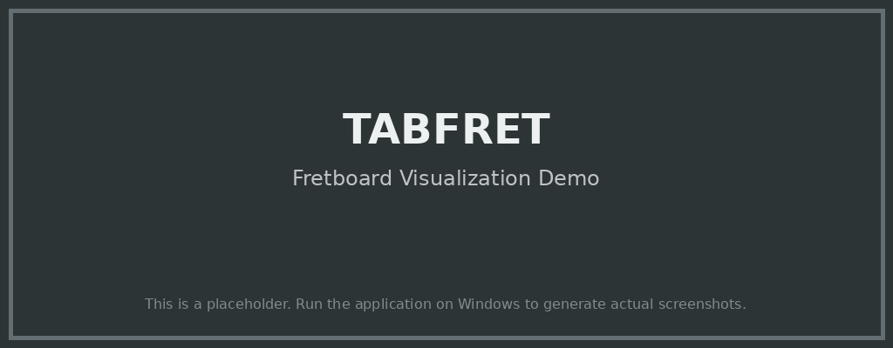

# TABFRET (MidiGuitarTab)

**TABFRET** is a Windows desktop application that displays MIDI files as guitar tablature and visualizes notes on a virtual guitar neck.

 <!-- Add or update the screenshot path if available -->

## Features

- **MIDI to Tab Conversion:** Load any MIDI file and see its notes converted into guitar tablature.
- **Virtual Fretboard Visualization:** Watch the notes light up in real time on a virtual guitar neck.
- **Customizable Tuning:** Supports various guitar tunings.
- **Playback Controls:** Listen to MIDI playback with synchronized visualizations.
- **User-Friendly Interface:** Intuitive UI designed for guitarists and musicians.
- **Export Options:** Save tabs or fretboard views as images for practice or sharing.

## Installation

### Prerequisites

- Windows 10 or higher
- [.NET Framework](https://dotnet.microsoft.com/download) (version X.X or later) <!-- Specify the required .NET version -->

### Download

1. [Download the latest release](https://github.com/GizzZmo/TABFRET/releases) from the Releases page.
2. Extract the ZIP file to your desired location.

### Run

Double-click `TABFRET.exe` to launch the application.

## Usage

1. **Open a MIDI File:** Click `File > Open` and select your MIDI file.
2. **View Tablature:** The app will display the guitar tab and the virtual fretboard.
3. **Playback:** Use the playback controls to listen to the MIDI and watch real-time visualization.
4. **Customize Tuning:** Change the tuning from the settings menu as needed.

## Demo

Coming soon! <!-- Or add a GIF/video link if available -->

## Screenshots

 <!-- Update path as needed -->

## Build from Source

1. Clone the repository:
   ```bash
   git clone https://github.com/GizzZmo/TABFRET.git
   ```
2. Open the solution in Visual Studio.
3. Restore NuGet packages and build the solution.
4. Run the application.

## Contributing

Contributions are welcome! Please:

- Open an issue for bug reports or feature suggestions.
- Fork the repo and submit a pull request for improvements.

## License

[MIT License](LICENSE)

## Credits

- Developed and maintained by [GizzZmo](https://github.com/GizzZmo)
- Inspired by the needs of guitarists and MIDI enthusiasts.

---

Feel free to modify or expand on this template as your project evolves! If you have assets like screenshots or demo videos, add their links or paths accordingly.
