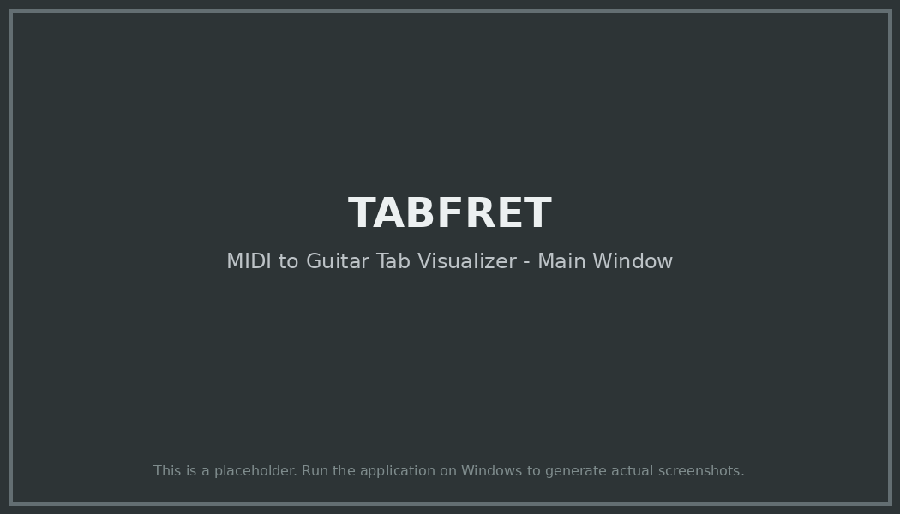

# TABFRET (MidiGuitarTab) 🎸

[](https://github.com/GizzZmo/TABFRET/actions/workflows/ci.yml)
[](https://github.com/GizzZmo/TABFRET/actions/workflows/release.yml)
[](https://dotnet.microsoft.com/download/dotnet/6.0)
[](LICENSE)
[](https://www.microsoft.com/windows)

**TABFRET** is a Windows desktop application that displays MIDI files as guitar tablature and visualizes notes on a virtual guitar neck in real-time.

 <!-- Add or update the screenshot path if available -->

---

## Table of Contents

- [Features](#features)
- [Installation](#installation)
- [Quick Start](#quick-start)
- [Usage](#usage)
- [Documentation](#documentation)
- [Building from Source](#building-from-source)
- [Contributing](#contributing)
- [Architecture](#architecture)
- [License](#license)
- [Credits](#credits)
- [Support](#support)

---

## Features

- **🎵 MIDI to Tab Conversion**: Load any MIDI file and see its notes converted into guitar tablature automatically
- **🎸 Virtual Fretboard Visualization**: Watch notes light up in real-time on a virtual guitar neck as the song plays
- **🎼 Guitar-Friendly Display**: Notes are mapped to guitar strings and frets using standard tuning (EADGBe)
- **▶️ Playback Controls**: Play, pause, and stop MIDI playback with synchronized visual feedback
- **🎯 Real-Time Highlighting**: Currently playing notes are highlighted in red on the fretboard
- **📊 Visual Fret Markers**: Standard guitar fret markers (dots at 3rd, 5th, 7th, 9th, 12th, 15th frets)
- **👁️ User-Friendly Interface**: Clean, intuitive UI designed specifically for guitarists and musicians
- **⚡ Fast Processing**: Quick MIDI parsing and tab generation

### What Makes TABFRET Unique?

- **Visual Learning**: See exactly where to place your fingers on the guitar neck
- **Real-Time Sync**: Watch notes as they should be played, perfect for learning songs
- **Automatic Mapping**: No manual transcription needed - load and play
- **Practice Tool**: Ideal for learning new songs, understanding note positions, and improving sight-reading

---

## Installation

### For End Users

#### Prerequisites

- **Operating System**: Windows 10 (version 1809 or later) or Windows 11
- **.NET Runtime**: .NET 6.0 Desktop Runtime or later
  - [Download .NET 6.0 Desktop Runtime](https://dotnet.microsoft.com/download/dotnet/6.0/runtime)
  - Choose "Download x64" under ".NET Desktop Runtime"

#### Download and Install

1. **Download TABFRET**
   - Go to the [Releases page](https://github.com/GizzZmo/TABFRET/releases)
   - Download the latest `TABFRET-v*.*.*.zip` file

2. **Extract the Files**
   - Right-click the downloaded ZIP file
   - Select "Extract All..."
   - Choose a destination folder (e.g., `C:\Program Files\TABFRET`)

3. **Run TABFRET**
   - Navigate to the extracted folder
   - Double-click `TABFRET.exe`
   - If prompted by Windows Defender SmartScreen:
     - Click "More info"
     - Click "Run anyway"

### System Requirements

| Component | Minimum | Recommended |
|-----------|---------|-------------|
| OS | Windows 10 (1809+) | Windows 11 |
| Processor | 1 GHz | 2 GHz or faster |
| RAM | 2 GB | 4 GB or more |
| Disk Space | 500 MB | 1 GB |
| Display | 1024x768 | 1920x1080 or higher |

---

## Quick Start

### Get Playing in 3 Steps

1. **Launch TABFRET**
   ```
   Double-click TABFRET.exe
   ```

2. **Load a MIDI File**
   ```
   Click "Load MIDI" → Select your MIDI file → Click "Open"
   ```

3. **Watch and Learn**
   ```
   Click "Play" and watch the notes highlight on the fretboard!
   ```

### Finding MIDI Files

Don't have MIDI files? Try these free resources:
- [FreeMIDI.org](https://freemidi.org) - Large collection of free MIDI files
- [BitMidi](https://bitmidi.com) - Free MIDI file archive
- [Midiworld.com](http://www.midiworld.com) - Categorized MIDI library

### Your First Song

For the best experience, start with:
- Simple melodies (not complex orchestral pieces)
- Single-instrument tracks
- Files labeled "guitar" or "guitar-friendly"

---

## Usage

### Basic Controls

| Button | Function | Keyboard (Future) |
|--------|----------|-------------------|
| **Load MIDI** | Open a MIDI file | Ctrl+O |
| **Play** | Start/resume playback | Space |
| **Pause** | Pause playback | Space |
| **Stop** | Stop and reset position | Escape |

### Understanding the Display

#### The Fretboard

```
String Layout (Top to Bottom):
┌─ High E (1st string) - Thinnest
│┌─ B (2nd string)
││┌─ G (3rd string)
│││┌─ D (4th string)
││││┌─ A (5th string)
│││││┌─ Low E (6th string) - Thickest
││││││
E |─●─────────5───────●───9─────────12─────●─
B |─────────────────────────────────────────
G |───────●─────────────────────────────────
D |─────────────────────●───────────────────
A |─────────────────────────────────────────
E |─────────────────────────────────────────
  │         │         │         │
  Nut      5th       9th       12th fret
  (0)      fret      fret       fret
```

#### Note Display

- **Blue circles (●)**: Notes in the song
- **Red circles**: Currently playing notes
- **Numbers inside circles**: Fret number to press
- **0**: Open string (don't press any fret)
- **White dots**: Fret position markers (3, 5, 7, 9, 12, 15)

### How to Read Tablature

Each note shows:
1. **Which string** to play (vertical position)
2. **Which fret** to press (number inside circle)
3. **When to play** (horizontal position = time)

**Example:**
```
Circle on G string at fret 3 = Press 3rd fret on G string
Circle at fret 0 = Play open string (no fret pressed)
```

### Tips for Best Results

1. **Use guitar-friendly MIDI files** for clearer results
2. **Start with simple songs** while learning the interface
3. **Pause frequently** to study finger positions
4. **Practice sections repeatedly** by stopping and replaying
5. **Learn the fret markers** to quickly locate positions

### Advanced Features (Coming Soon)

- 🎚️ **Speed Control**: Slow down for practice
- 🔁 **Loop Sections**: Repeat difficult parts
- 🎵 **Audio Playback**: Hear the MIDI while watching
- 🎸 **Custom Tunings**: Support for alternate tunings
- 💾 **Export**: Save tablature as images or PDFs

---

## Documentation

### For Users

- **[User Guide](USER_GUIDE.md)**: Comprehensive guide for end users
  - Installation instructions
  - Interface overview
  - How to use all features
  - Tips and tricks
  - Troubleshooting
  - FAQs

### For Developers

- **[Development Guide](DEVELOPMENT.md)**: Set up your development environment
  - Prerequisites and tools
  - Building from source
  - Running tests
  - Debugging tips
  - Common development tasks

- **[Architecture Guide](ARCHITECTURE.md)**: Understand the application structure
  - MVVM pattern explained
  - Project structure
  - Core components
  - Data flow diagrams
  - Design decisions

- **[Contributing Guide](CONTRIBUTING.md)**: How to contribute to TABFRET
  - Code of conduct
  - Development workflow
  - Coding standards
  - Pull request process
  - Reporting bugs

### CI/CD Documentation

- **[CI/CD Quick Start](QUICK_START_CICD.md)**: Quick guide to our automation
- **[CI/CD Summary](CI_CD_SUMMARY.md)**: Overview of workflows
- **[Workflow Documentation](.github/workflows/README.md)**: Detailed workflow guide
- **[Workflow Architecture](.github/workflows/ARCHITECTURE.md)**: CI/CD architecture

---

## Building from Source

### For Developers

Want to build TABFRET yourself or contribute to development? Follow these steps.

#### Prerequisites

- **Windows 10 or higher** (WPF requires Windows)
- **Visual Studio 2022** (Community Edition or higher)
  - Install the ".NET desktop development" workload
- **.NET 6.0 SDK** or later
- **Git** for version control

#### Clone and Build

1. **Clone the repository**
   ```bash
   git clone https://github.com/GizzZmo/TABFRET.git
   cd TABFRET
   ```

2. **Restore NuGet packages**
   ```bash
   dotnet restore TABFRET.sln
   ```

3. **Build the solution**
   ```bash
   dotnet build TABFRET.sln --configuration Release --no-restore
   ```

4. **Run tests** (optional but recommended)
   ```bash
   dotnet test TABFRET.sln --configuration Release --no-build
   ```

5. **Run the application**
   ```bash
   dotnet run --project src/TABFRET.csproj
   ```

#### Using Visual Studio

1. Open `TABFRET.sln` in Visual Studio 2022
2. Press `Ctrl+Shift+B` to build
3. Press `F5` to run with debugging
4. Or `Ctrl+F5` to run without debugging

#### Create Release Package

To create a distributable package:

```bash
dotnet publish src/TABFRET.csproj \
  --configuration Release \
  --output ./publish \
  --runtime win-x64 \
  --self-contained true
```

The compiled application will be in the `./publish` folder.

### Project Structure

```
TABFRET/
├── src/                    # Source code
│   ├── Models/             # Data models
│   ├── Views/              # XAML UI files
│   ├── ViewModels/         # MVVM ViewModels
│   ├── Services/           # Business logic
│   └── Utils/              # Helper utilities
├── tests/                  # Unit tests
├── assets/                 # Images and resources
├── .github/                # GitHub Actions workflows
└── docs/                   # Additional documentation
```

### Dependencies

TABFRET uses these key libraries:

- **[Melanchall.DryWetMidi](https://github.com/melanchall/drywetmidi)** (v6.0.0): MIDI file parsing and manipulation
- **[NAudio](https://github.com/naudio/NAudio)** (v2.2.1): Audio playback support
- **[Microsoft.Extensions.DependencyInjection](https://www.nuget.org/packages/Microsoft.Extensions.DependencyInjection)** (v8.0.0): Dependency injection

See [DEVELOPMENT.md](DEVELOPMENT.md) for detailed development instructions.

---

## Contributing

We welcome contributions from the community! Whether you're fixing bugs, adding features, improving documentation, or suggesting ideas, your help is appreciated.

### How to Contribute

1. **Fork the repository** on GitHub
2. **Create a feature branch**: `git checkout -b feature/my-feature`
3. **Make your changes** following our coding standards
4. **Test your changes** thoroughly
5. **Commit your changes**: `git commit -m "Add: Description of changes"`
6. **Push to your fork**: `git push origin feature/my-feature`
7. **Open a Pull Request** on GitHub

### Contribution Areas

- 🐛 **Bug Fixes**: Fix issues reported in the issue tracker
- ✨ **New Features**: Add new functionality (discuss first in an issue)
- 📝 **Documentation**: Improve or add documentation
- 🧪 **Tests**: Add or improve test coverage
- 🎨 **UI/UX**: Enhance the user interface
- ⚡ **Performance**: Optimize existing code

### Before Contributing

Please read our [Contributing Guide](CONTRIBUTING.md) for:
- Code of conduct
- Coding standards and style guidelines
- Development workflow
- Pull request checklist
- How to report bugs
- How to suggest enhancements

### Quick Links

- **[Report a Bug](https://github.com/GizzZmo/TABFRET/issues/new?labels=bug)**: Found an issue? Let us know!
- **[Request a Feature](https://github.com/GizzZmo/TABFRET/issues/new?labels=enhancement)**: Have an idea? We'd love to hear it!
- **[Ask a Question](https://github.com/GizzZmo/TABFRET/discussions)**: Need help? Start a discussion!

---

## Architecture

TABFRET is built using modern software engineering practices and design patterns.

### Technology Stack

- **Framework**: WPF (Windows Presentation Foundation)
- **Language**: C# (.NET 6.0)
- **Pattern**: MVVM (Model-View-ViewModel)
- **Libraries**: DryWetMidi, NAudio, Microsoft.Extensions.DependencyInjection

### Architecture Highlights

```
┌─────────────────────────────────────┐
│         User Interface (XAML)       │
│  MainWindow  │  GuitarNeckView      │
└────────────────┬────────────────────┘
                 │ Data Binding
┌────────────────▼────────────────────┐
│         ViewModels (Logic)          │
│          MainViewModel              │
└────────────────┬────────────────────┘
                 │
┌────────────────▼────────────────────┐
│      Services (Business Logic)      │
│  MidiParser  │  TabMapper           │
└────────────────┬────────────────────┘
                 │
┌────────────────▼────────────────────┐
│       Models (Data Structures)      │
│   MidiNote   │   TabNote            │
└─────────────────────────────────────┘
```

### Key Design Decisions

- **MVVM Pattern**: Clear separation between UI, logic, and data
- **Observable Collections**: Automatic UI updates through data binding
- **Service Layer**: Reusable business logic separated from presentation
- **Async/Await**: Non-blocking I/O operations for better responsiveness

For detailed architecture information, see [ARCHITECTURE.md](ARCHITECTURE.md).

---

## License

This project is licensed under the **MIT License** - see the [LICENSE](LICENSE) file for details.

### What This Means

- ✅ **Free to use** for personal and commercial purposes
- ✅ **Modify** the code as you wish
- ✅ **Distribute** copies of the software
- ✅ **Private use** allowed
- ⚠️ **Must include** copyright notice and license
- ❌ **No warranty** provided

---

## Credits

### Author & Maintainer

- **[GizzZmo](https://github.com/GizzZmo)** - Creator and primary developer

### Contributors

Thank you to all contributors who have helped improve TABFRET! 🙏

<!-- Contributors will be automatically listed by GitHub -->
See the [Contributors page](https://github.com/GizzZmo/TABFRET/graphs/contributors) for a full list.

### Third-Party Libraries

TABFRET wouldn't be possible without these excellent open-source projects:

- **[Melanchall.DryWetMidi](https://github.com/melanchall/drywetmidi)**: Professional MIDI library for .NET
- **[NAudio](https://github.com/naudio/NAudio)**: Audio and MIDI library for .NET
- **[Microsoft.Extensions.DependencyInjection](https://github.com/dotnet/runtime)**: Dependency injection framework

### Inspiration

Inspired by the needs of guitarists, music teachers, and MIDI enthusiasts who want to visualize and learn guitar music from MIDI files.

---

## Support

### Getting Help

- 📚 **[User Guide](USER_GUIDE.md)**: Comprehensive user documentation
- 💬 **[Discussions](https://github.com/GizzZmo/TABFRET/discussions)**: Ask questions and share ideas
- 🐛 **[Issues](https://github.com/GizzZmo/TABFRET/issues)**: Report bugs or request features
- 📖 **[Wiki](https://github.com/GizzZmo/TABFRET/wiki)**: Additional tips and tutorials (if available)

### Frequently Asked Questions

**Q: Does TABFRET work on Mac or Linux?**  
A: Currently, TABFRET is Windows-only due to WPF. Cross-platform support may come in future versions.

**Q: Can TABFRET play audio from MIDI files?**  
A: Visual playback is available now. Audio playback is planned for a future release.

**Q: What MIDI formats are supported?**  
A: TABFRET supports standard MIDI files (.mid, .midi) - both Type 0 and Type 1.

**Q: Can I use custom guitar tunings?**  
A: Currently, only standard tuning (EADGBe) is supported. Custom tunings are planned for future releases.

**Q: Is TABFRET free?**  
A: Yes! TABFRET is open source and completely free to use under the MIT License.

For more FAQs, see the [User Guide](USER_GUIDE.md#frequently-asked-questions).

### Community

Join the TABFRET community:

- ⭐ **Star this repo** if you find it useful
- 👁️ **Watch** for updates and new releases
- 🍴 **Fork** to create your own version
- 💬 **Discuss** ideas and ask questions

### Reporting Issues

Found a bug? Please report it!

1. Check [existing issues](https://github.com/GizzZmo/TABFRET/issues) first
2. Create a [new issue](https://github.com/GizzZmo/TABFRET/issues/new) if needed
3. Include:
   - Windows version
   - TABFRET version
   - Steps to reproduce
   - Expected vs. actual behavior
   - Screenshots (if applicable)

---

## Roadmap

### Current Version (v1.x)

- ✅ MIDI file loading and parsing
- ✅ Guitar tablature generation
- ✅ Virtual fretboard visualization
- ✅ Real-time note highlighting
- ✅ Basic playback controls

### Planned Features

#### Version 2.0
- 🎵 Audio playback with synchronized visualization
- 🎚️ Speed control (slow down for practice)
- 🔁 Loop sections for repeated practice
- 🎸 Custom guitar tunings support

#### Future Enhancements
- 💾 Export tablature as PDF/images
- 📊 Multi-track MIDI support
- 🎸 Chord recognition and labeling
- 🎮 Interactive practice mode
- 📱 Tablet/mobile companion app
- ☁️ Cloud storage for MIDI files
- 🎯 Difficulty analysis and recommendations

### Want to Help?

Check the [Issues page](https://github.com/GizzZmo/TABFRET/issues) for:
- 🏷️ **"good first issue"**: Great for new contributors
- 🏷️ **"help wanted"**: Features we'd love help with
- 🏷️ **"enhancement"**: Planned improvements

---

## Acknowledgments

Special thanks to:

- The **WPF community** for excellent documentation and examples
- The **DryWetMidi** project for an amazing MIDI library
- All **contributors** who have helped improve TABFRET
- **Users** who provide feedback and suggestions

---

## Stay Updated

- 📢 **[Releases](https://github.com/GizzZmo/TABFRET/releases)**: Download the latest version
- 📝 **[Changelog](https://github.com/GizzZmo/TABFRET/releases)**: See what's new
- 🐦 **Follow** [@GizzZmo](https://github.com/GizzZmo) for updates (if social media available)

---

<div align="center">

**Made with ❤️ for guitarists and MIDI enthusiasts**

[⬆ Back to Top](#tabfret-midiguitartab-)

</div>
